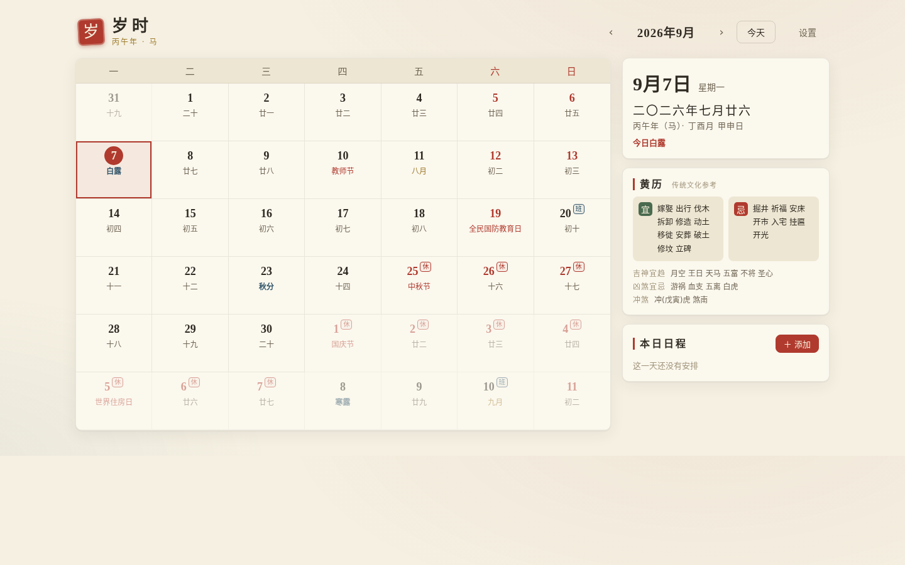

# 岁时 · 中国风个人日历

个人使用的中国风格 Web 日历：农历为第一公民，日程管理完整，无广告、无账号、数据完全保存在本地浏览器。



## 功能

**历法层**

- 公农历双历对照（月视图每格同显）
- 二十四节气（当天突出显示，详情页含下一节气倒数）
- 传统节日（春节、元宵、清明、端午、七夕、中秋、重阳、除夕等，农历推算）与公历节日
- 干支纪年/月/日、生肖
- 法定节假日与调休补班（休/班角标），数据来自 [holiday-cn](https://github.com/NateScarlet/holiday-cn)（每日自动同步国务院公告，经 jsDelivr 获取并本地缓存；当前年份内置快照兜底）

**民俗层（可在设置中关闭）**

- 每日黄历宜忌、吉神宜趋、凶煞宜忌、冲煞（基于 [lunar-typescript](https://github.com/6tail/lunar-typescript) 计算，传统文化参考）

**日程层**

- 日程增删改查：标题、日期、时间、备注、五种分类颜色
- 重复规则：每天 / 每周 / 每月 / 每年 / **每年（农历）**——农历生日自动落在每年对应农历日，遇腊月三十无三十的年份自动落到除夕
- 到点浏览器通知提醒
- 近期日程与倒数日速览
- 数据仅存于本浏览器（localStorage），支持导出/导入 JSON 备份

## 开发

```bash
npm install
npm run dev      # 开发
npm test         # vitest 单元测试
npm run build    # 构建产物在 dist/
npm run preview  # 预览构建产物
```

环境要求 Node 20+。历法计算、宜忌内容全部来自 lunar-typescript 本地计算，除拉取节假日数据外完全离线可用。

## 部署

已部署在自有服务器服务器 **http://SERVER_IP/calendar/**。

更新流程：

```bash
npm run build
rsync dist/ SERVER_WEBROOT
```

`vite.config.ts` 的 `base` 必须保持 `'/calendar/'`；nginx 配置在服务器 `NGINX_CONF`。

## 设计

配色取传统色：宣纸底（#f5f0e2）、墨（#2f2a22）、朱砂（#b03a2e）、黛青（#33566b）、赭金（#a07d2e）；标题用楷体/宋体，今日以朱砂圆章标记，节气用黛青、节日用朱砂、月首用赭金区分。

## 项目文档

- [市场调研报告](docs/market-research.md)——立项依据与竞品分析
